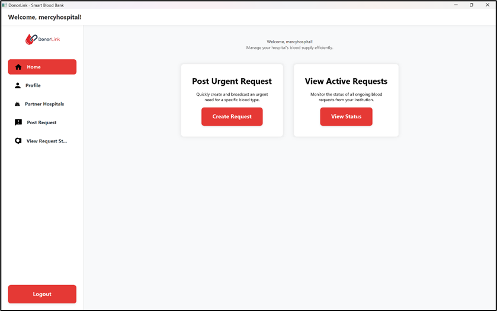
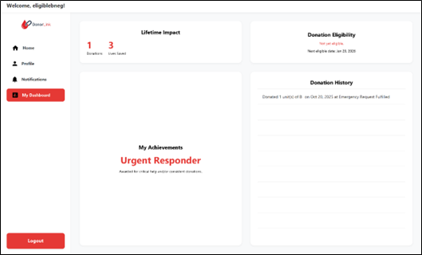
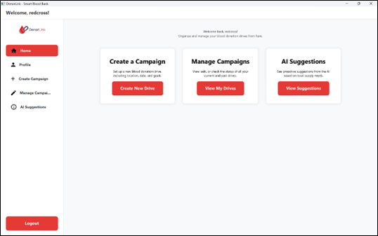
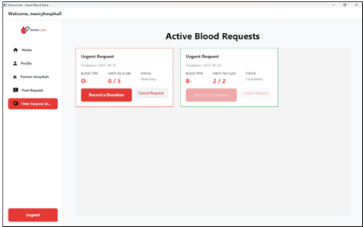
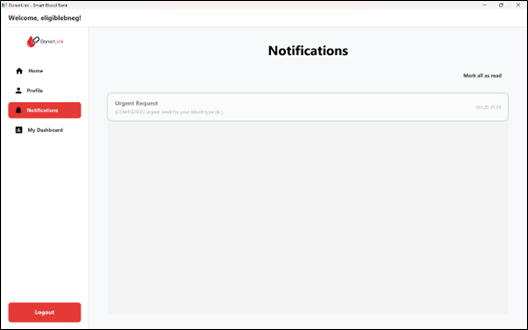
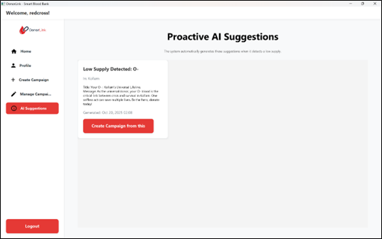
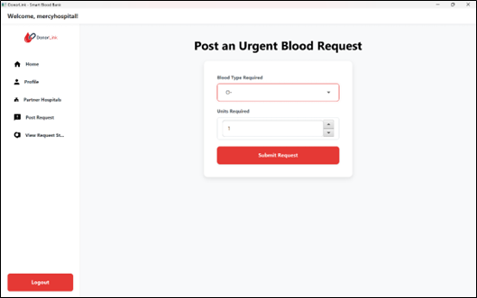
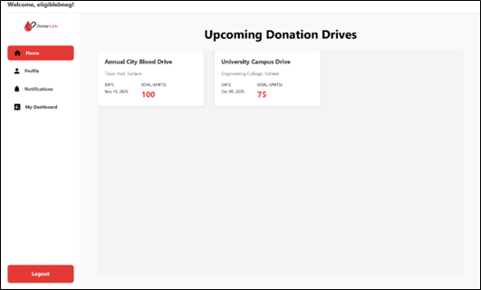
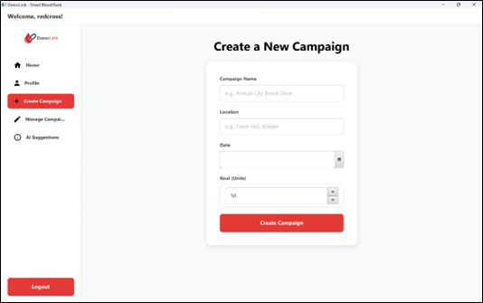

<

# DonorLink: AI-Enabled Smart Blood Bank

**DonorLink** is a JavaFX desktop application designed to solve critical inefficiencies in blood donation management. It connects hospitals, donors, and campaign organizers on a single, real-time platform powered by Google Firebase and the Gemini AI.

This project was developed as our final year project at T.K.M College of Engineering by:
* <a href="https://www.linkedin.com/in/rasalmusthafa">**Rasal Musthafa** (TKM24CS105)</a>
* <a href="https://www.linkedin.com/in/faheem-shan-b6872a339">**Faheem Shan A** (TKM24CS054)</a>
* <a href="https://www.linkedin.com/in/shan-m-a-ab763a330/">**Shan M A** (TKM24CS122)</a>
* <a href="https://www.linkedin.com/in/safdil-arafath-277bba377/">**Safdil Arafath** (TKM24CS111)</a>
* <a href="https://www.linkedin.com/in/">**Ayman Riyaz** (TKM24CS048)</a>

---

## 🎯 The Problem
Traditional blood management is slow and reactive. It suffers from:
* **Information Silos:** Disconnected hospital inventories lead to delays.
* **Inefficient Donor Mobilization:** Difficulty finding eligible, compatible, nearby donors quickly during emergencies.
* **Reactive Nature:** Systems often only respond to crises, lacking proactive planning.
* **Poor Donor Retention:** Lack of engagement and visible impact discourages repeat donations.

## ✨ Our Solution
DonorLink provides a centralized, role-based system with:
* **Real-time Blood Requests:** Hospitals post urgent needs, triggering immediate system action.
* **Intelligent Two-Phase Matching:** An algorithm first checks partner hospital inventories (Phase 1) before alerting compatible voluntary donors (Phase 2), optimizing resource use.
* **AI-Powered Campaign Suggestions:** Uses the Google Gemini API to suggest targeted campaigns when donor searches fail for specific blood types, enabling proactive management.
* **Enhanced Donor Engagement:** A personalized dashboard shows donation history, lives saved, eligibility status, and earned badges, fostering a sense of community and impact.

---

## 📸 Application Screenshots

| Hospital Staff Workflow                  | Donor Workflow                         | Campaign Organizer Workflow          |
| :--------------------------------------- | :------------------------------------- | :----------------------------------- |
|  |  |  |
|          |      |          |
|              |            |        |

---

## 🛠️ Tech Stack & Architecture
* **Frontend:** Java 17, JavaFX 21, FXML, CSS
* **Backend & Database:** Google Firebase (Firestore Real-time Database, Firebase Authentication) using Firebase Admin SDK
* **AI:** Google Gemini API (gemini-2.5-flash model via Java HTTP Client)
* **Build:** Apache Maven
* **Logging:** SLF4J & Logback
* **Architecture:** Model-View-Controller (MVC)

### Class Diagram


---

## 🚀 How to Run This Project

To run this project locally, you need to set up your own Firebase and Gemini API credentials.

1.  **Clone the repository:**
    ```bash
    git clone [https://github.com/ras-al/SmartBloodBank.git)
    cd SmartBloodBank
    ```
2.  **Set up Firebase:**
    * Create a Firebase project at [console.firebase.google.com](https://console.firebase.google.com/).
    * Create a **Firestore Database** (start in production mode).
    * Go to **Project Settings > Service Accounts**. Generate a new private key (`.json` file).
    * Set the environment variable `GOOGLE_APPLICATION_CREDENTIALS` to the *full, absolute path* of this downloaded `.json` file.
    * Enable **Firebase Authentication** and add the "Email/Password" sign-in provider.

3.  **Set up Gemini API:**
    * Get an API key from [Google AI Studio](https://aistudio.google.com/).
    * Set the environment variable `GEMINI_API_KEY` to this key.

4.  **Build and Run:**
    * Open the project's `pom.xml` in an IDE like IntelliJ IDEA or Eclipse.
    * Allow Maven to download dependencies.
    * Ensure your environment variables (`GOOGLE_APPLICATION_CREDENTIALS` and `GEMINI_API_KEY`) are correctly set in your IDE's run configuration or your system environment.
    * Run the `com.example.smartbloodbank.main.MainApplication` class.
